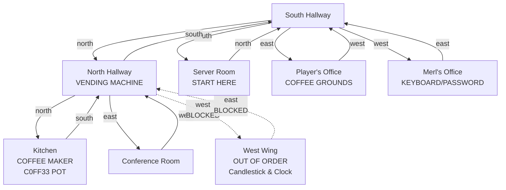

# Game Design Questionnaire
## "The Password Hunt" - Office Adventure

This document contains all design questions we need to answer before implementation.
We'll go through these **ONE AT A TIME** to build the complete game design.

---

## SECTION 1: ENGINEER CHARACTER

### Q1: What is the lead engineer's name?
- Options: Dave, Bernard, Steve, something absurd/funny?
- **Your answer:** **Merl** (short for Merlin, fits the "wizard" theme perfectly)

### Q2: Physical appearance - what do they look like?
- Thick glasses? Hoodie? Band t-shirt? Something else?
- **Your answer:** **Older engineer with a thick Unix-style grey beard, thick glasses, wearing a hoodie and ball cap. Has over-ear headphones. Vibe-coder aesthetic - keeps sunglasses at his desk for when he "vibe-codes"**

### Q3: What's on their mechanical keyboard?
- RGB lights? Vintage mechanical? Custom keycaps? Plain?
- **Your answer:** **Mechanical keyboard similar to the old IBM clicky keyboards (Model M style) but not as obnoxiously loud. Has F-keys down the left side. Meta where Alt could be, or is it Alt where Meta could be? (Classic Unix/Lisp machine confusion). Vintage tactile feel, fits the Unix wizard aesthetic perfectly.**

### Q4: What surrounds their desk besides the monitors and coffee mug?
- Options: Empty coffee cups, pizza boxes, rubber ducks, energy drink cans, programming books, action figures, etc.
- **Your answer:** **At least 4 rubber ducks sitting below his monitors. One duck is named "The Dread Pirate Roberts" and has a trimmed-down post-it on the monitor serving as the duck's name placard. He has dual monitors + a laptop for the 3rd monitor setup (but it looks like he's working from 20 monitors due to all the windows/terminals open).**

  **Programming books scattered around:**
  - "Implementing Quantum Entanglement in Java"
  - "The Heap, the Stack, and You"
  - "It's Not DNS, It's Always DNS"
  - "Heap Dumps and Mem Leaks"
  - "Python Isn't Just About Snakes"
  - "YAML in Spaces"
  - "The Designs of Everyday Things"
  - "Assembler: Why Oh Why?"
  - "CP1610 Game Development"
  - "The 3 Ds of Automation"
  - "How to Write Software That No One Will Read"
  - "Insert Token, Push Button, Get Snack - LLMs the Wrong Way"

### Q5: What absurd project are they working on?
- Examples:
  - "Refactoring the blockchain AI neural network"
  - "Contributing to GNU/Hurd rewrite in Rust"
  - "Implementing quantum entanglement in JavaScript"
  - Something else?
- **Your answer:** **Writing bytecode compiler for HTCPCP (Hyper Text Coffee Pot Control Protocol) - the April Fools' RFC 2324. Perfect blend of coffee obsession and obscure internet protocol nerdery. He occasionally mutters and laments about "418 I'm a teapot" status codes while debugging.**

### Q6: Are they wearing headphones?
- If YES: Can they still hear the player talk to them?
- **Your answer:** **Yes, has over-ear headphones (established in Q2). Most of the time they're down around his neck so he CAN hear you. Occasionally he'll put them on for a brief moment, bob his head to the music, then slide them back down around his neck. This is another repetitive behavior to observe.**

### Q7: Any other repetitive behaviors besides trying to drink empty coffee?
- **Your answer:** **Summary of all repetitive behaviors:**
  1. **Empty coffee mug**: Tries to drink from it, looks inside, sighs when empty, sets it down, repeats
  2. **Headphone music moments**: Occasionally puts headphones on for a brief moment and bobs his head to music (you can hear snippets - sounds like chiptune mixed with heavy metal mixed with early 60s pop Beatles and their later 60s experimental stuff), then slides them back down around his neck
  3. **Pushes glasses up**: Periodically adjusts his thick glasses (established in GAME_DESIGN.md)
  4. **Mutters about 418**: Occasionally laments about "418 I'm a teapot" status codes while debugging his HTCPCP compiler

---

## SECTION 2: VENDING MACHINE PUZZLE (Initial/Warmup)

### Q8: What is the player's initial state?
- How does being "too hungry to think/hear" manifest in the game?
- Examples:
  - Can't hear the engineer's sighs/mutterings?
  - Can't focus enough to notice details?
  - Text is fuzzy or confusing?
  - Room descriptions are minimal?
- **Your answer:** **"Tunnel vision" hunger state:**
  - **Can't focus on details**: Most descriptions are minimal/foggy
  - **Room descriptions are sparse**: Only essential elements visible
  - **Can't notice Merl's behaviors**: His repetitive actions (coffee mug, headphones, etc.) aren't visible to you - too distracted
  - **BUT clear focus on survival**: Token, vending machine, and snack are perfectly clear (tunnel vision effect)
  - **Periodic reminder**: "Your stomach growls" message appears every 5-10 turns (randomized) to remind player they're hungry
  - **Only one snack available**: Located at position **C3** in the vending machine
  - **Easter egg**: When snack is dispensed, display shows "PO" briefly - player thinks it means "Purchase Offered" and shrugs it off (actually completes C-3PO reference)

### Q9: Where is the vending machine located?
- Break room? Hallway? Your cubicle area?
- **Your answer:** **Hallway - positioned between Merl's cubicle/work area and the kitchen/break room area. Serves as a transition space between the two main zones.**

### Q10: Where does the player find the token?
- Option A: Already in your pocket/inventory
- Option B: On your desk
- Option C: Need to find it somewhere
- Option D: Other?
- **Your answer:** **Option D - In the vending machine's coin return slot. A forgotten token from a previous transaction.**

### Q11: If player needs to find the token (Q10 = C), where is it?
- **Your answer:** **In the vending machine's coin return slot. Visual hint: The vending machine description mentions something "shiny" visible in the coin return slot, drawing the player's attention. Commands like "examine coin return", "check coin return", or "look in coin return" will reveal and allow taking the token.**

### Q12: What snacks are in the vending machine?
- Just one option or multiple choices?
- What are they? (chips, candy bar, granola bar, energy bar, etc.)
- **Your answer:** **Only one snack: "Byte Bar" - Wrapper says "8 bits of nutrition!" Perfect tech pun for the programmer theme. Located at position C3 (established in Q8).**

### Q13: What happens after player eats the snack?
- What specifically changes?
- Examples:
  - "Your head clears. You can think again."
  - Can now hear engineer's coffee mug attempts?
  - Can now notice more details in room descriptions?
- **Your answer:** **After eating the Byte Bar, three things change:**
  1. **Hunger satisfied / head clears**: "The fog in your mind lifts. You can think clearly again."
  2. **Room descriptions expand**: Rooms go from sparse/minimal to full, detailed descriptions with all objects visible
  3. **Can now notice Merl's repetitive behaviors**: Empty coffee mug attempts, sighing, headphone bobbing, pushing glasses up, muttering about "418 I'm a teapot" - these were always happening but you were too distracted to notice

  **Note**: Merl's speech was ALWAYS understandable (not garbled), you just weren't paying attention before due to hunger tunnel vision.

### Q14: Is the vending machine puzzle required to progress?
- Option A: Yes, must eat before you can notice the coffee puzzle
- Option B: No, it's optional (just helpful)
- **Your answer:** **Option A: Yes, must eat before you can notice the coffee puzzle. The mechanics established in Q13 confirm you cannot observe Merl's repetitive behaviors (especially the empty coffee mug attempts) until AFTER eating the Byte Bar. This makes the vending machine puzzle a required tutorial/warmup that unlocks the main coffee puzzle.**

### Q15: Any funny/absurd text for the vending machine or snacks?
- Vending machine description?
- Snack wrapper description?
- **Your answer:**

  **Token:**
  - Worn metallic token with ambiguous marking that could be read as "10", "01", or "IO" depending on how you look at it (nod to vibecoder 1.z3r0)

  **Vending Machine:**
  - **Display screen**: Says "Insert Token" (when empty/waiting)
  - **Warning labels**: "Do Not Shake" and "Contains Food-Like Substances"
  - **Physical condition**: The glass and frame look like they were once attacked by a rabid wolverine, or a hungry developer - not sure which
  - **Coin return**: Something shiny visible inside (the token)

  **Byte Bar wrapper:**
  - **Manufacturer**: "0g" (pronounced "Zero Gram")
  - **Main text**: "Byte Bar" and "8 bits of nutrition!" (established in Q12)
  - **Ingredient claim**: "Free of Malloc()s and Null Pointers" (parody of health food labels)
  - **Wrapper design**: Everything else on the wrapper is written in 0s and 1s (binary), except the product name, company name, and ingredient claim
  - **Position**: C3 in vending machine (established in Q8)

---

## SECTION 3: COFFEE PUZZLE

### Q16: Coffee machine complexity - how hard is it to brew coffee?
- Option A: Simple - just "brew coffee" and it works
- Option B: Medium - need to find coffee grounds, add water, press button (3 steps)
- Option C: Complex/Absurd - multi-step ridiculous process (clean filter, grind beans, sacrifice to coffee gods, etc.)
- **Your answer:** **Between Option B and C - Multi-step with absurd comedy elements, but not overly complex. The 418 teapot swap is the key comedic moment (callback to Merl's "418 I'm a teapot" lament).**

### Q17: Based on your answer to Q16, what EXACTLY are the steps to brew coffee?
- List the specific actions the player must take:
- **Your answer:**
  1. **Plug in the coffee maker** (it's currently unplugged)
  2. **Remove the pot labeled "418"** from the coffee maker (it's a teapot - callback to Merl's "418 I'm a teapot" lament)
  3. **Insert the pot labeled "C0FF33"** into the coffee maker (the proper coffee pot - hex/leetspeak for COFFEE)
  4. **Find coffee grounds** and add them to the filter
  5. **Brew coffee** (press the button/start brewing)

### Q18: Where are the coffee-making ingredients/items located?
- Coffee grounds: **At the player's desk (visible only after eating the Byte Bar - absurd detail that the solution was right there all along)**
- Water: **Already in the coffee maker reservoir (one less step)**
- Filter (if needed): **Assume filter already in coffee maker (or not needed)**
- Other items:
  - **C0FF33 pot**: On a table in the kitchen area (visible only after eating the Byte Bar)
  - **418 pot**: Already IN the coffee maker at game start (visible when investigating after eating snack)
  - **Power plug**: Right next to the coffee maker (discovered when investigating the coffee maker area)

### Q19: How does the engineer know coffee is ready?
- Option A: Smell automatically triggers them to leave (player doesn't need to do anything)
- Option B: Player needs to tell them "coffee's ready" or similar
- Option C: Player needs to bring them a cup
- Option D: Something else?
- **Your answer:** **Option B with magical absurdity: Player tells Merl the coffee is ready. If coffee IS actually brewed, Merl can smell it in the air. In a wink of his eye and tip of his hat, you swear his ball cap transforms into a pointy floppy wizard hat as he disappears in a flash to get coffee. His chair is left spinning as the magical vibes dissipate. (Pays off the "open source wizard" theme with literal wizard transformation!)**

### Q20: What happens when engineer leaves for coffee?
- Option A: They stay in the break room permanently (no time pressure)
- Option B: They return after X turns (creates urgency)
- Option C: Something else?
- **Your answer:** **Option C: Merl stays in the break room enjoying his coffee, but periodically appears as a ghostly/magical presence - Force ghost style - to taunt or encourage you with Obi-Wan Kenobi-like wisdom. Example lines: "Use the keyboard!" and "Use the keyboard, young padawan..." This adds comedy without time pressure, and pays off the wizard/magical theme even further!**

### Q21: If they return (Q20 = B), how many turns before they come back?
- **Your answer:** **N/A - Q20 = Option C (Force ghost encouragement instead of returning)**

---

## SECTION 4: ROOM LAYOUT & NAVIGATION

### Q22: How many rooms total in the game?
- Option A: Minimal (2-3 rooms)
- Option B: Medium (4-5 rooms)
- Option C: Larger (6+ rooms)
- **Your answer:** **Option C: 8 rooms total. South Hallway and North Hallway serve as connecting hubs. Player starts in the Server Room.**

### Q23: What specific rooms exist in the game?
Check all that apply and add any custom rooms:
- [x] Player's Office / Your Cubicle (east of South Hallway - has coffee grounds on your desk)
- [x] Merl's Office / Engineer's Cubicle (west of South Hallway - has keyboard/password)
- [x] South Hallway (southern hub)
- [x] North Hallway (northern hub - has VENDING MACHINE)
- [x] Kitchen / Break Room (north of North Hallway - has coffee maker, C0FF33 pot on table)
- [x] Conference Room (east of North Hallway)
- [ ] Bathroom
- [x] Server Room (starting location - south of South Hallway)
- [ ] Manager's Office
- [ ] Supply Closet
- [x] West Wing (west of North Hallway - "Out of Order" sign, strange candlestick, small grandfather clock - Maniac Mansion easter egg)
- [ ] Other: _______________

### Q24: Where does the player start the game?
- **Your answer:** **Server Room (established in Q22)**

### Q25: Draw the room connections (which rooms connect to which)?
Example format: "Your Cubicle is west of Hallway. Break Room is east of Hallway."
- **Your answer:**

**Text format:**
- Server Room (START) connects:
  - NORTH to South Hallway
- South Hallway (southern hub) connects:
  - SOUTH to Server Room
  - EAST to Player's Office
  - WEST to Merl's Office
  - NORTH to North Hallway
- Player's Office connects:
  - WEST to South Hallway
  - Contains: Coffee grounds on desk
- Merl's Office connects:
  - EAST to South Hallway
  - Contains: Keyboard with password underneath
- North Hallway (northern hub - has VENDING MACHINE) connects:
  - SOUTH to South Hallway
  - NORTH to Kitchen
  - EAST to Conference Room
  - WEST to West Wing (blocked by "Out of Order" sign)
- Kitchen / Break Room connects:
  - SOUTH to North Hallway
  - Contains: Coffee maker, C0FF33 pot on table
- Conference Room connects:
  - WEST to North Hallway
- West Wing:
  - EAST to North Hallway (blocked - can see but not enter)
  - Contains visible: "Out of Order" sign, strange candlestick, small grandfather clock (Maniac Mansion easter egg)

**Mermaid diagram:**

---

## SECTION 5: KEYBOARD & POST-IT

### Q26: What happens if player tries to take/lift keyboard while engineer is there?
- What's the funny/absurd rejection message?
- **Your answer:** **Merl goes full Gandalf-in-Khazad-dûm mode: Dramatically declares "You shall not pass!" (or similar), smacks away your hands, glares at you intensely, then immediately goes back to coding as if nothing happened. Pays off the wizard theme with a Lord of the Rings reference!**

### Q27: When engineer is gone, what command(s) work to access the post-it?
- Option A: "lift keyboard" only
- Option B: "look under keyboard" only
- Option C: Both A and B work
- Option D: Something else?
- **Your answer:** **Option C: Multiple commands work for good UX - "lift keyboard", "look under keyboard", and "take keyboard" all reveal the post-it underneath. "Take keyboard" doesn't actually take the keyboard object, just shows what's under it (same result as lift/look). Natural language flexibility for the player.**

### Q28: What exact text is written on the post-it note?
- Examples: "Password: hunter2", "Password: C0ff33IsL1f3", "Password: correct_horse_battery_staple"
- **Your answer:** **Password: NullC0FF33Exception** - Perfect multi-layered pun: references NullPointerException (Java), Merl's empty coffee cup (null coffee = exception state), uses leetspeak (C0FF33 = COFFEE), and ties directly to the puzzle motivation!

### Q29: Is the post-it immediately visible when keyboard is lifted?
- Option A: Yes, immediately visible
- Option B: Need to search or examine more carefully
- **Your answer:** **Option A: Yes, immediately visible. After all the puzzle-solving, the player gets immediate payoff - lift/look/take keyboard and the post-it is right there with the password.**

---

## SECTION 6: NPC INTERACTIONS

### Q30: What does engineer say if you ask them about the password?
- Option A: "Mmph, check under my keyboard" (spoils puzzle)
- Option B: "Can't talk, debugging critical race condition" (doesn't spoil)
- Option C: They ignore you completely
- Option D: Something else?
- **Your answer:** **Option B: Merl gives various responses (randomized or cycled) that don't spoil the puzzle:**
  - "Can't talk, debugging critical race condition"
  - "You're messing with my vibes."
  - "Not now, I'm in the zone"
  - "Mmph" (goes back to coding without looking up)
  - "Ask me later, compiling..." (You glance at his screen - clearly nothing is compiling, but you think better of pointing this out)

### Q31: What does engineer say/do if you ask/tell them about coffee?
- **Your answer:** **Different responses based on context:**

  **1. Asking about coffee (before it's brewed):**
  - Merl: "Coffee, that's a good idea."
  - Tries to take a sip from his mug
  - Realizes it's empty
  - Sighs
  - Goes back to coding

  **2. Telling him "coffee's ready" when it IS actually brewed:**
  - Triggers the wizard transformation (established in Q19)
  - Sniffs the air, smells the coffee
  - Ball cap transforms into wizard hat
  - Disappears in a flash to get coffee

  **3. Telling him "coffee's ready" when it's NOT actually brewed:**
  - Merl sniffs the air
  - "I can tell there is no coffee brewing."
  - Dismissive wave of the hand, motioning for you to leave
  - Goes back to coding

### Q32: What other topics can you ask the engineer about? (besides LLMs which we have)
List topics and their responses:

- **Topic: Rubber ducks / "The Dread Pirate Roberts"** → Response: Merl glances at the ducks, "Ah yes, my debugging companions. The Dread Pirate Roberts here has helped me solve countless segfaults." Goes back to coding.

- **Topic: Books** → Response: "That collection? Years of accumulated wisdom. Though 'YAML in Spaces' still gives me nightmares." Shudders slightly, returns to work.

- **Topic: Music / Headphones** → Response: "The perfect coding soundtrack - a little chiptune, some Beatles, maybe some metal. Keeps the vibes flowing." Puts headphones on briefly, bobs head, slides them back down.

- **Topic: Keyboard** → Response: **Merl's eyes light up.** Picks up the keyboard enthusiastically. "This beauty! Mechanical switches, tactile feedback, the perfect key travel... listen to this..." Demonstrates typing in the air. Sets the keyboard back down. **As he does, you think you see something underneath it for a split second, but couldn't tell what it was.** (HINT!) Merl is already back to coding, oblivious.

- **Topic: Asking for help / Help with password** → Response: Merl looks up from his screen, genuinely interested. "Oh, sure! Let me help you with that..." Starts to turn toward you, then something on his monitor catches his eye. "Wait, is that a—" Gets completely absorbed in whatever appeared on screen. Back to coding. You've been forgotten.

---

## SECTION 7: WIN CONDITION

### Q33: What triggers victory?
- Option A: Just reading the post-it = instant win
- Option B: Taking the post-it = instant win
- Option C: Need to actually use the password to log into your computer
- Option D: Something else?
- **Your answer:** **Option C: Player must actually use the password to log into their computer. After getting the password from under the keyboard, they need to return to their desk and successfully log in. This completes the full puzzle cycle.**

### Q34: What is the exact victory message?
- **Your answer:** **"Skynet has been successfully launched from your workstation - have a nice day!"** - Darkly comedic twist ending: after all the effort to log in, you accidentally trigger a robot apocalypse. Perfect absurd payoff!

---

## SECTION 8: FAILED ATTEMPTS & COMEDY

### Q35: What happens if you try to push/move the engineer physically?
- **Your answer:** **Cycling responses (rotate through all 4 on repeated attempts):**
  - **Response 1:** Merl doesn't budge at all - he's completely immovable, as if rooted to the chair by some mysterious force. You bounce off harmlessly. Merl doesn't even look up from coding.
  - **Response 2:** The moment you make contact with Merl, you feel a strange tingling sensation and your hands go slightly numb. Merl glances up briefly, "Personal space, dude," then goes back to coding. The tingling fades after a few seconds.
  - **Response 3:** It's like trying to move a boulder. Merl is surprisingly heavy and immovable. He's so focused on his work that he doesn't even acknowledge your attempt, continuing to type away as if nothing is happening.
  - **Response 4:** Merl spins his chair around to face you with surprising speed, gives you a Gandalf-esque "You shall not pass!" glare that stops you in your tracks, then spins back to his monitors and continues coding without another word.

### Q36: What happens if you try to unplug their computer/monitors?
- **Your answer:** **Cycling responses (rotate through all 4 on repeated attempts):**
  - **Response 1:** As you reach for the power cable, Merl's hand shoots out without him even looking up from the screen. He gently but firmly redirects your hand away. "Don't even think about it," he mutters, eyes still locked on code.
  - **Response 2:** The moment you touch the power cable, all the monitors flicker and display a giant red warning: "CRITICAL SYSTEM - DO NOT DISCONNECT" - but you can see this is just Merl's custom screensaver trigger. He spins around: "Nice try."
  - **Response 3:** You reach for the plug, but the cables seem to be hopelessly tangled in an impossible knot under the desk. It would take hours to untangle them, and Merl is sitting right there anyway.
  - **Response 4:** The power cables glow faintly with magical energy when you touch them. A voice whispers "You cannot break the connection..." Merl doesn't seem to notice anything unusual. The vibes are strong with this workstation.

### Q37: What happens if you try to take their coffee mug?
- **Your answer:** **Cycling responses (rotate through all 4 on repeated attempts):**
  - **Response 1:** You reach for the mug. Merl glances over, sees it's empty anyway, and waves his hand dismissively. "Go ahead, it's not like there's any coffee in it." As you pick it up, you notice the bottom has a permanent coffee ring stain that looks almost like a magical rune. You set it back down. Merl is already back to coding.
  - **Response 2:** The moment you touch the mug, Merl's head snaps toward you with laser focus. "That's mine." His stare is intense enough to make you back away slowly. He cradles the mug as you retreat.
  - **Response 3:** You lift the mug slightly - it's completely empty and bone dry. Merl notices the movement and sighs deeply. "Yeah, I know. Story of my life." Takes it back and sets it down with a sad look at the empty interior.
  - **Response 4:** The mug seems stuck to the desk, as if glued there by years of coffee residue and magical coding energy. It won't budge. Merl doesn't even notice your attempt - the mug is clearly not going anywhere.

### Q38: What happens if you try to talk to them when they're in "the zone"?
- **Your answer:** **Cycling responses (rotate through all 4 on repeated attempts):**
  - **Response 1:** You say something to Merl. He nods absently, "Uh-huh... yeah... sure..." without looking away from the screen. Five seconds later: "Wait, what did you say?" But by the time you start to repeat yourself, he's already back in the zone, typing furiously.
  - **Response 2:** You try to get his attention. Merl holds up one finger in a "just a minute" gesture, eyes glued to the screen. "Almost got it... almost..." The finger stays up. Minutes pass. He's completely forgotten you're there.
  - **Response 3:** You speak to Merl. No response. You try again, louder. Still nothing. He's wearing headphones, but they're not on his ears - they're hanging around his neck. The music is playing but he's so focused he doesn't notice they're not actually on his head.
  - **Response 4:** You say something to Merl. He mutters back, but it's clearly a response to whatever's on his screen, not to you. "No, that won't compile... try the other function... yeah, that's the one..." Never breaks eye contact with his monitors. You're not even sure he knows you're in the room.

### Q39: Any other funny failed attempts you want custom responses for?

- **Attempt: Trying to read Merl's screen** → Response: The code on screen seems to shift and blur when you try to focus on it. Lines of text rearrange themselves. Either it's protected by some magic, or you're just as tired as you thought. Merl doesn't notice your attempt.

- **Attempt: Trying to type on Merl's keyboard while he's using it** → Response: Your fingers and Merl's fingers collide on the keys. He doesn't even look at you, just keeps typing, somehow working around your hands with practiced ease. After a few seconds of this awkward keyboard battle, you give up. Merl never broke his flow.

- **Attempt: Trying to turn off the lights in his office** → Response: You flip the light switch. Nothing happens. You flip it again. Still nothing. You look at the switch - it's covered in a small post-it note that reads "Nice try - M" in Merl's handwriting. When did he have time to put that there?

- **Attempt: Trying to take one of the rubber ducks** → Response: The moment you touch The Dread Pirate Roberts, Merl's hand shoots out and gently but firmly moves it back to its original position. "The Dread Pirate Roberts stays," he says without looking up. "We're debugging something important."

- **Attempt: Trying to close/minimize Merl's programs** → Response: You reach for his mouse. Merl's hand covers yours, moves it away from the mouse, and returns to typing - all without him looking away from the screen. "Don't even think about it," he mutters.

- **Attempt: Trying to unplug his headphones** → Response: You reach for the headphone cable. A small spark of static electricity zaps your finger. "Ow!" Merl glances over. "Yeah, the vibes are electric today." Goes back to coding.

- **Attempt: Trying to take a book from his shelf** → Response: You pull on one of the coding books. It doesn't budge. You pull harder. The whole shelf creaks but the book stays put. Either these books are decorative or magically sealed. Merl doesn't notice your struggle.

- **Attempt: Asking "What are you working on?"** → Response: Merl launches into an incredibly technical explanation involving recursive algorithms, lambda functions, and something about quantum entanglement in database transactions. After about 30 seconds your eyes glaze over. He's still talking. You slowly back away. He doesn't notice you've left.

---

## SECTION 9: OBJECTS & DETAILS

### Q40: What's at YOUR desk (the player's workstation)?
- Locked computer? Personal items? Your own coffee mug? Stress ball?
- **Your answer:**
  - **Locked computer** (requires password - this is where you'll need to log in at the end)
  - **Coffee grounds** (in a bag or container - needed for the coffee maker puzzle)
  - **1.z3r0 the vibe-coding duck** (your faithful debugging companion - a yellow rubber duck with "1.z3r0" written on it in marker)
  - **Empty coffee mug** (just like Merl's - you're both in the same boat)
  - **Standard office items:** keyboard, mouse, monitor(s), some scattered sticky notes, pens
  - **A few coding books** (well-worn copies, dog-eared pages)
  - The desk is functional but lived-in - clearly belongs to a developer

### Q41: What's in the break room besides the coffee maker?
- Refrigerator? Microwave? Vending machine? Sink? Table and chairs?
- **Your answer:**
  - **Coffee maker** (the main puzzle item - currently has 418 teapot, needs C0FF33 pot)
  - **Table and chairs** (C0FF33 pot is sitting on the table)
  - **Microwave** (when examined closely, has a postal stamp stuck to one of the inside walls and a small yellow sweater that looks like it would fit a hamster - no explanation for either)
  - **Refrigerator** (probably contains questionable leftovers and expired condiments)
  - **Sink** (for washing mugs, if anyone ever actually does that)
  - **Cabinets** (basic supplies - napkins, plastic utensils, etc.)
  - **Counter space** (typical break room setup)
  - The room is functional but has that "shared space" energy where weird things accumulate and no one questions them

### Q42: Are there any red herrings (objects that seem useful but aren't)?
- **Your answer:** _______________

---

## SECTION 10: OPTIONAL FEATURES

### Q43: Should there be a turn limit or time pressure?
- **Your answer:** _______________

### Q44: Should there be alternate ways to solve the puzzle?
- If yes, describe: _______________

### Q45: Any easter eggs or hidden jokes you want to include?
- **Your answer:** _______________

### Q46: Any other NPCs in the office?
- Manager? Intern? Janitor? Coworkers?
- **Your answer:** _______________

---

## SECTION 11: TONE & FLAVOR

### Q47: Tone for room descriptions - dry/deadpan, over-the-top, or mix?
- **Your answer:** _______________

### Q48: Any other running gags besides the coffee mug attempts?
- **Your answer:** _______________

### Q49: Any other absurd visual details like the "3 monitors look like 7" effect?
- **Your answer:** _______________

---

*We'll go through these ONE AT A TIME. Ready to start with Q1?*
